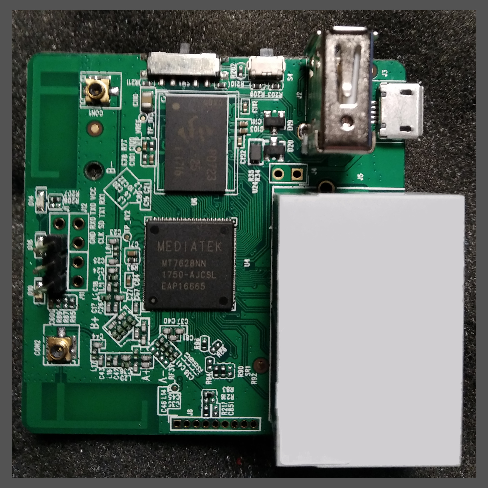

# GL-MT300N-V2


```
--------------------|--------------------------------------------------------------
CPU                 | MTK7628NN @580Mhzz
--------------------|--------------------------------------------------------------
Memory/Storage      | DDR2 128MB/ FLASH 16MB
--------------------|--------------------------------------------------------------  
Interfaces          | 1 WAN, 1 LAN, 1 USB2.0, 1 micro USB (power), 1 Reset button
--------------------|--------------------------------------------------------------  
WiFi Frequency      | 2.4GHz
--------------------|--------------------------------------------------------------  
Transmission rate   | 300Mbps
--------------------|--------------------------------------------------------------  
Max Tx Power        | 20dBm
--------------------|--------------------------------------------------------------  
DIY features        | UART, 4GPIO, 3.3V & 5V power port
--------------------|--------------------------------------------------------------  
Power input         | 5V/1A
--------------------|--------------------------------------------------------------  
Power consumption   | <2.75W
--------------------|--------------------------------------------------------------
```


